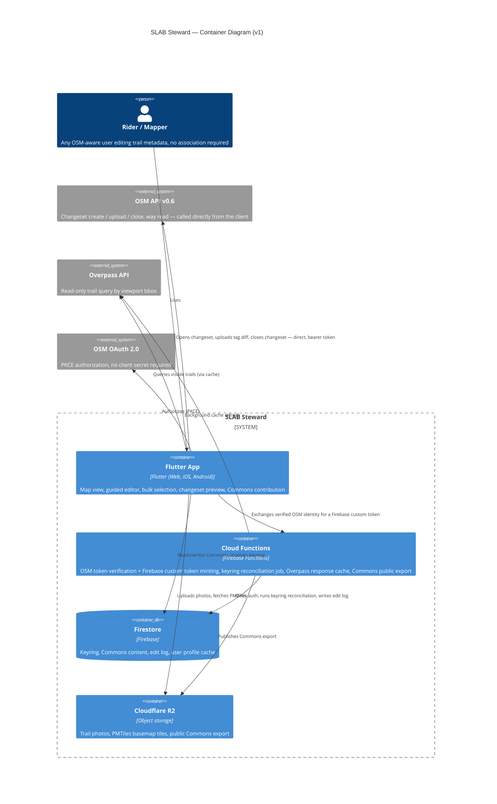

# SLAB Steward — Product Description (v1)

**An OSM metadata editor for laypeople.** Web + mobile, built on the existing SLAB stack.

*August 2026 — scoping document to start development*

---

## 0. Framing

The steward research concluded the association-only framing was too narrow to be a business, but exactly right as a data-seeding arm. This spec widens the audience one step further: **v1 is not gated behind an association relationship at all.** Any OSM-aware or OSM-curious rider can open the tool, find a trail they know, and add metadata to it under their own OSM account. Association-tier features (approve/reject queues, region ownership, bulk moderation) come later, once there's a reason to build them.

This is a real improvement on the research doc's proposed sequencing, not just a rename. The association segment has ~200 IMBA chapters, near-zero software budget, and low usage frequency (§4.2 of the research doc). Individual riders are a completely different addressable set — closer to the 9.2M figure in the founder brief — and they don't need anyone's permission to start. It also removes the dependency on WMBC saying yes before anything ships.

It does raise the stakes on one thing the research doc flagged for the org-scoped version: **Organised Editing Guidelines compliance.** A tool that makes bulk edits easy, used by many individual accounts, at volume, in a coordinated way, is very likely to read as organized editing to the OSM community whether or not there's a formal "campaign." Treat the OEG wiki page and hashtag discipline as v1 requirements, not P1 nice-to-haves — see §9.

---

## 1. Scope

### In v1

- Map view to find and select **existing** OSM trail ways
- Guided, opinionated metadata editor — difficulty, surface, sanction status — no raw tag keys ever shown
- Bulk selection and bulk attribute application across multiple trails
- Submission under the user's own OSM account via OAuth 2.0, with a human-reviewed changeset preview before anything is written
- An open companion data store ("Commons") for trail photos, conditions, and closures — content OSM's data model structurally cannot hold — keyed to durable trail identity via a keyring, not raw OSM way IDs

### Explicitly out of v1 (see §8 for how the design still leaves room)

- Drawing new trail geometry / adding trails that don't exist in OSM yet
- Association accounts, region ownership, approve/reject queues, multi-tier permissions
- Change monitoring / "Stewardship Watch" alerting
- Sanction & Display Policy Registry (consumer-app-facing honoring of sanction status)
- Directionality (`oneway`) editing
- A public REST API for Commons (v1 ships a static open export instead — see §7.4)

---

## 2. Core User Flow

1. **Discover.** Open the map. Trail ways in the visible viewport render with a completeness indicator (has difficulty? has surface?). Tap a trail to select it, or use a filter ("missing difficulty") to narrow the view first.
2. **Select.** Single-select for one trail, or enter bulk mode to multi-select via repeated tap (v1) — see §4 on why lasso drawing is deferred.
3. **Edit.** A short guided form: pick a difficulty icon, pick a surface, optionally flag sanction status. No tag keys, no numeric scales, no free text required.
4. **Preview.** Plain-language before/after per trail ("Add difficulty: Medium (blue square)"), plus the actual changeset that will be opened, for the technically curious.
5. **Submit.** One tap. The app opens a changeset under the user's own OSM OAuth token, uploads the diff, closes the changeset. Confirmation shows the changeset link on osm.org.
6. **Optional: add Commons content.** Attach a photo, flag a condition, or log a closure — written to SLAB's own store, not OSM, with no changeset involved.

---

## 3. Metadata Model — the Opinionated Layer

This is the part "../product"worth getting right, because it's the whole value proposition: hide OSM's tagging complexity behind SLAB's existing difficulty iconography without silently lying about what's being written.

### 3.1 Difficulty

OSM has two difficulty tags, and picking the wrong one matters:

- **`mtb:scale:imba` (0–4)** — the approved tag for the IMBA Trail Difficulty Rating System: the white-circle/green-circle/blue-square/black-diamond/double-black-diamond signage scheme most riders already recognize. Its wiki definition scopes it to purpose-built trails (bike parks, North Shore features), recommending `mtb:scale` for natural trails instead — but there's a long-running, unresolved tagging-list disagreement about that scope, with experienced mappers arguing it should apply anywhere a trail carries signposted IMBA-style ratings, natural or not.
- **`mtb:scale` (0–6)** — the STS-derived natural-trail scale, based on tread variability, obstacle height, and grade thresholds. Not signage-shaped, not something a layperson can self-assess without training.

**Decision for v1:** write `mtb:scale:imba` exclusively, because it's the tag that actually matches the circle/square/diamond picker SLAB already designed, and because that's how working mappers use it in practice regardless of the wiki's formal scope note. Treat `mtb:scale` as an advanced/optional field for a later release aimed at experienced contributors — asking a rider to estimate percent grade or obstacle height in centimeters violates the "never make them think in tag semantics" constraint.

| SLAB label | Icon | Tag written |
|---|---|---|
| Beginner | purple circle | `mtb:scale:imba=0` |
| Easy | green circle | `mtb:scale:imba=1` |
| Medium | blue square | `mtb:scale:imba=2` |
| Difficult | black diamond | `mtb:scale:imba=3` |
| Expert | double black diamond | `mtb:scale:imba=4` |
| Pro Line | double orange diamond | `mtb:scale:imba=4` + Commons flag |
| Un-rated | empty gold ring | *(no tag written)* |

**Pro Line has no OSM equivalent** — the schema tops out at 4. Write `4` to OSM (it genuinely is "extremely difficult" by that schema) and preserve the Pro Line distinction as a Commons-only refinement (`proLine: true`). Don't invent a value OSM doesn't recognize; don't lose the distinction that makes SLAB's icon set useful either.

**Un-rated writes nothing.** Absence of the tag *is* the un-rated state — this is what makes a future completeness dashboard possible without any extra bookkeeping.

### 3.2 Surface

Simplified picker, mapped to standard `surface=*` values:

| SLAB label | Tag written |
|---|---|
| Hardpack / Groomed | `compacted` |
| Natural Dirt | `ground` |
| Loose over Hard | `fine_gravel` or `gravel` *(finalize which reads better at implementation time)* |
| Rock / Rock Garden | `rock` |
| Sand | `sand` |
| Paved / Hardsurface | `paved` |

**Known gap, worth naming rather than papering over:** OSM's `surface` key has no value for "root-heavy," which is one of the more distinctive PNW trail characteristics. There isn't a clean tag for it. Rather than force a bad mapping, leave it unmapped in v1 and consider a Commons-only "tread character" attribute later — that's exactly the kind of subjective, non-verifiable descriptor that belongs in Commons rather than OSM per the research doc's boundary (§3.2 of the research doc).

### 3.3 Sanction Status

This is the field that touches the actual political fault line in this space (research doc §2.2, §4.2). Handle it with more friction than the other two fields, on purpose.

| SLAB label | OSM tags | Commons |
|---|---|---|
| Sanctioned | *(none, or `access=yes` if useful)* | — |
| Unsanctioned – Tolerated | `informal=yes` | — |
| Sensitive – Suppress | `informal=yes` (if not already present) | `displayPolicy: suppress` |

Two things to build in from day one:

- **A required short justification** when marking anything other than "Sanctioned" ("why do you believe this is unsanctioned?"), carried into the changeset comment. This is the same verifiability expectation the OSM community already holds mappers to, and it's cheap friction that filters out careless taps on a genuinely contentious field.
- **"Suppress" only controls what SLAB's own app renders.** It is not and cannot be an OSM edit that hides anything — OSM won't remove trails, and no tag makes a trail invisible to other consumers. Say this explicitly in the UI copy. Overpromising here is exactly the kind of trust violation the research doc warns is fatal with this community.

### 3.4 Freshness

`check_date` is stamped automatically to the submission date on every edit. Never a user-facing field — it's a byproduct of editing, not something to ask about.

### 3.5 Explicitly deferred fields

Directionality (`oneway`), `smoothness`, `width`, `incline` — real OSM fields, all reasonable v1.1 additions once the guided-editor pattern is proven. Not in v1; the three fields above are the ones actually requested and they're enough to prove the pattern.

---

## 4. Bulk Edit Design

**Selection, v1:**
- Tap-to-toggle selection on the map (add/remove trail from the working set)
- List view with the same completeness filters used for discovery ("show only trails missing difficulty")
- Selection count and a running summary always visible

**Deferred:** true polygon/lasso drawing. It's a genuinely nice UX for "select everything in this valley," but it's an added map-interaction surface (drawing, editing vertices, hit-testing) for a v1 that doesn't need it yet — tap-select plus filters covers the actual bulk-editing use case (fix all the trails missing a rating) at a fraction of the build cost. Fast-follow candidate once the core loop is proven.

**Applying attributes:** one form, applied identically across the whole selection. Per-trail overrides aren't a v1 feature — if a batch needs different values per trail, that's multiple bulk-edit passes with different filters, not a spreadsheet-style bulk editor.

**Changeset mechanics:** one changeset per bulk-edit submission (OSM's element-per-changeset ceiling is far above anything a single session will produce), tagged with `created_by`, a `comment` describing the batch in plain language, and a `#SLABSteward` hashtag so the OSM community can find and audit these edits as a group. This hashtag discipline is the cheapest possible OEG-adjacent transparency move and should never be skipped, even for a single-trail edit.

---

## 5. The Keyring — Durable Trail Identity

The research doc calls this "the single most important architectural decision in the product," and that's still true here. OSM way IDs are not stable: ways split at junctions, merge, get redrawn. Anything in Commons keyed on a raw way ID will silently orphan itself over time.

**v1 design — deliberately conservative:**

- Every trail Steward touches gets a `slabTrailId` (UUID), minted lazily the first time a user selects it — not backfilled proactively across all of OSM.
- Keyring entry: `{ slabTrailId, osmWayIds: [...], lastKnownVersion, geometryHash, boundingBox, firstSeenAt, lastResolvedAt }`.
- A scheduled Cloud Function periodically re-checks keyring entries against current OSM state. If a way's version has changed, refetch and compare geometry (Turf.js buffer/overlap). Clean matches update the entry silently. Ambiguous cases (a way split into pieces with no clear inheritor) are surfaced for human resolution in-app rather than guessed at automatically.

**What v1 deliberately does not do:** write a `ref:slab=*` anchor tag into OSM itself, the way the research doc's association-scoped version proposed (`ref:wmbc=GAL-0142` style). That pattern is legitimate when it's an association asserting its own `operator=` reference — it's much shakier as a vendor tool tagging arbitrary trails with a product-specific reference before SLAB has any standing in the OSM community. Revisit this once (and only once) a real association partnership exists and wants it. Geometry-fallback matching is slower and occasionally ambiguous, but it doesn't ask the OSM community to trust an unproven tool's tagging scheme on day one.

---

## 6. Commons — the Open Companion Store

Content that structurally doesn't belong in OSM (unstable, subjective, or time-bound — full reasoning in the research doc §3.2): trail photos, condition reports, closures.

- **Keyed on `slabTrailId`**, never on raw OSM way IDs, for the reason above.
- **Firestore** collection `commons/{slabTrailId}` holding a denormalized summary doc, with `images`, `conditions`, and `closures` subcollections.
- **Media** (photos) live in R2, following the existing date-versioned key pattern already used elsewhere in SLAB's pipeline (`commons/{slabTrailId}/images/{yyyy-mm-dd}/{imageId}.jpg`); Firestore stores only the R2 key and metadata.
- **Read access is open** — Firestore security rules allow public reads on Commons collections; writes require a Firebase-authenticated session tied to a verified OSM identity (see §9).
- **Anyone can contribute**, not just people editing through Steward — the store is designed as a shared surface, consistent with the "no future owner can lock this up" commitment that's core to SLAB's positioning.

### 7.4 — Making "open" concrete at low cost

Firestore access alone doesn't satisfy the open-data commitment for third parties who don't want to touch Firebase's SDK or credentials. Reuse the "latest pointer" pattern already established elsewhere in the pipeline: a scheduled Cloud Function exports Commons to a public, versioned GeoJSON file on R2, with a `latest` pointer. Cheap to build now (it's the same pattern as the tile pipeline), and it's the difference between "open in principle" and "open in practice."

---

## 7. Architecture



**Why direct client → OSM API, no proxy:** confirmed against OSM's own OAuth documentation and the `osm-api-js` library (a browser-first client explicitly built to authenticate and upload changesets from the browser without a backend) that the standard OSM API endpoints support this pattern — CORS is not the blocker it was historically. On mobile, CORS doesn't apply at all. This keeps the backend thin: Cloud Functions handle identity bridging and background jobs, not every write. Consistent with the existing "no servers to maintain where avoidable" preference.

**Firestore, not Postgres/PostGIS.** The Commons and keyring data are small, document-shaped, and don't need spatial SQL — geometry matching happens client- or function-side via Turf.js against OSM/Overpass responses, not via a spatial index in the datastore itself. Matches the existing Firebase-centric backend rather than introducing Supabase/Postgres for this one surface.

**No Overpass hotlinking at scale.** Every map pan hitting Overpass directly, from every client, risks rate-limiting or a ban from the public instance. The Cloud Function cache layer (short TTL, keyed by tile/bbox) exists specifically to avoid that — cheap to build, protects the whole app from a shared-resource failure mode.

**Dart, not `osm-api-js`, for the actual OSM API calls.** The research doc's JS recommendation doesn't carry over cleanly to a cross-platform Flutter app — a JS library only helps the web build. The OSM API v0.6 surface needed here (fetch way, open changeset, upload diff, close changeset) is small enough that a lean, dedicated Dart client is the better fit for a single codebase across web and mobile.

---

## 8. Trail Creation — Deferred, Not Foreclosed

v1 explicitly does not support drawing new trail geometry. The data model shouldn't need surgery when that comes:

- Keyring entries don't require `osmWayIds` to be non-empty from creation — a Commons-only, pending trail (photos and notes gathered, no OSM way yet) is already a representable state, it's just not exposed as a UI flow yet.
- The editor architecture (selection → guided form → changeset preview → submit) is the same shape a "draw a new way, then tag it" flow would need; the missing piece is a geometry-drawing step ahead of the existing form, not a different pipeline.

---

## 9. Identity & Auth

1. Client initiates OSM OAuth 2.0 with PKCE (no client secret needed for a public client — confirmed current OSM practice).
2. User authorizes on openstreetmap.org, client receives an access token directly.
3. Client calls a Cloud Function with that token; the function verifies it against OSM's `/api/0.6/user/details` endpoint, extracts the OSM user ID, and mints a Firebase custom token keyed to `osm:{osmUserId}`.
4. Client signs in to Firebase with that custom token — this is what gives Firestore security rules a reliable identity for Commons writes and the edit log, without building a second auth system.
5. The OSM access token itself is held client-side (secure storage on mobile; short-lived, memory-scoped handling on web, where persistent secure storage is weaker) and used directly for OSM API calls — it never needs to transit or live on SLAB's backend.

**Register an OSM Organised Editing Guidelines wiki page before shipping bulk edit**, regardless of the individual-account framing — a tool that makes many-trail edits easy, used by many accounts, is the exact shape OEG exists to cover, and the compliance cost (one wiki page, open communication channels, no private coordination) is small next to the trust cost of skipping it.

---

## 10. Data Model Sketch (Firestore)

```
users/{osmUserId}
  displayName, avatarUrl, editCount (cached), lastSeenAt

keyring/{slabTrailId}
  osmWayIds: [...]
  lastKnownVersion, geometryHash, boundingBox
  firstSeenAt, lastResolvedAt, needsReview: bool

commons/{slabTrailId}
  summary: { hasOpenClosure, latestConditionStatus, imageCount, proLine, displayPolicy }
  images/{imageId}       — r2Key, uploadedBy, uploadedAt, caption
  conditions/{condId}    — status, reportedBy, reportedAt, notes
  closures/{closureId}   — startDate, endDate, reason, source

edit_log/{changesetId}
  osmUserId, wayIds, tagsChanged, submittedAt, changesetUrl
```

**`edit_log` is cheap to write now and valuable later.** It costs one write per submission and requires no extra design work, but it's exactly the raw material the research doc's completeness-scorecard concept (§5.2 of the research doc) would need — building it now means that feature is a query away later instead of a data-migration project.

---

## 11. Open Questions / Validation Items

Flagging these honestly rather than asserting confidence I don't have yet:

- **OAuth token lifetime on OSM's side** — confirm actual expiry/refresh behavior for OSM's OAuth 2.0 tokens before designing the re-auth UX; don't assume parity with typical short-lived-token + refresh-token patterns.
- **Web secure storage for the OSM token** — browsers don't offer mobile-grade secure storage. Worth deciding early whether the web build re-authenticates more often, or whether a short-lived session model is acceptable there.
- **`fine_gravel` vs. `gravel`** for "Loose over Hard" — pick based on how it actually looks rendered in the consuming apps SLAB cares about (own app plus AllTrails/Gaia), not in the abstract.
- **OEG wiki page content** — draft this alongside the bulk-edit feature, not after; it should describe the tool's actual behavior, not be backfilled once patterns are already set.

---

## 12. Success Criteria for v1

- A rider can find a real trail, apply a correct difficulty and surface rating, and see the resulting changeset live on osm.org, start to finish, in under two minutes.
- Bulk edit correctly and legibly previews a multi-trail changeset before submission — no surprises between what's shown and what's written.
- At least one Commons photo and one condition report exist for a real trail, contributed through the tool, publicly readable without a Firebase credential.
- Zero `ref:slab` tags written to OSM. Zero raw tag keys shown to a user anywhere in the guided flow.
