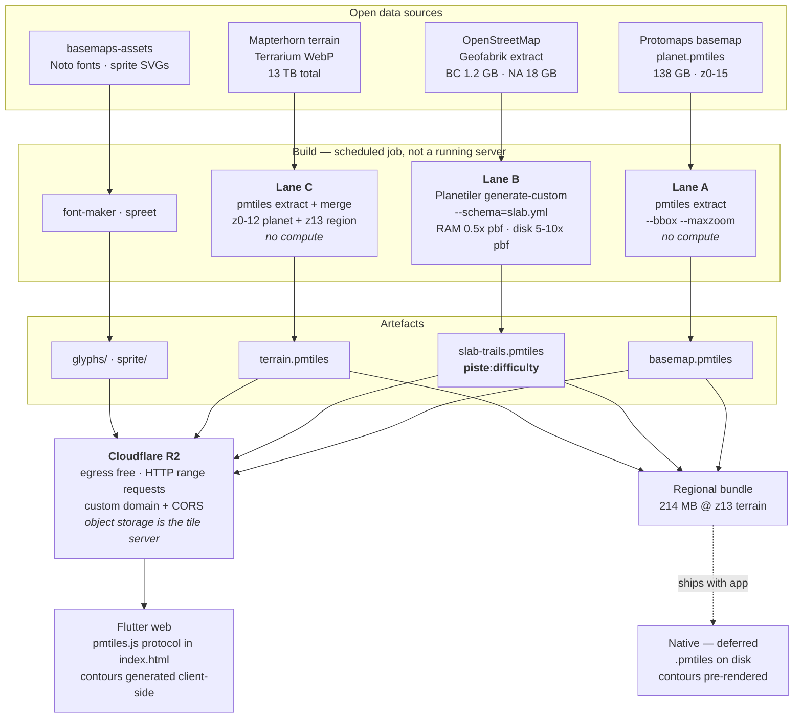

# Sandbox

Throwaway-by-default experiments that aren't part of the app. Nothing in `lib/`
imports anything here, and nothing here ships.

- **[tile-lab/](tile-lab/)** — a bench for basemap styles. See below.

---

# Tile Lab

A one-page MapLibre app for trying basemap styles under Steward's trail
overlay, aimed at one question: **how much of the ski-resort / bike-park map
look can a style buy, before anyone renders a tile?**

Short answer: most of it. Three styles ship here and none of them needs an API
key, a tile server, or a build step.

## Run it

```sh
cd sandbox/tile-lab
python3 -m http.server 8791
open http://localhost:8791
```

That's the whole setup. MapLibre GL and maplibre-contour are vendored into
`vendor/`, so the page has no install step and no CDN dependency at runtime. It
does need a *server* rather than `file://`, because it loads ES modules.

The URL carries the camera (`#zoom/lat/lng/bearing/pitch`), so a view worth
arguing about is a link.

## The three styles

Each one is an argument about where the information should live. Switch between
them on the same ridge — that comparison is the point of the lab.

| | What it argues |
|---|---|
| **Piste** | Winter resort poster. The terrain is *painted*, not coloured: near-black conifer, snow-white relief, runs reading as ribbons cut through the trees. Contours are hidden — shape comes from light. |
| **Loam** | The painted bike-park poster. Overwhelmingly dark conifer, thinning to scree and snow above treeline, with trails as thin bright ribbons and white callout plates on the summits. Contours survive as quiet texture rather than as the subject — toggle them off for the pure painted look. |
| **Ridgeline** | Engraved ink on paper. No landcover at all, grey multidirectional relief, heavy contours — and difficulty as the *only* colour anywhere. Arguably the most honest hierarchy of the three for an app whose job is "which line should I ride", and the cheapest to render. |


The **Whistler Bike Park** viewpoint is framed the way the printed poster is —
village at the bottom, Whistler Peak at the top, looking south up the mountain.
It is the fastest way to judge whether a change helped.

## The four things that actually make the look

Ranked by how much they buy. None is exotic; the leverage is in combining them.

**1. The DEM, used three ways.** One AWS terrarium source feeds the hillshade,
the elevation tint (`color-relief`) and the contour lines. This is the single
biggest lever — it is roughly the whole difference between "an OSM map" and "a
trail map". `maplibre-contour` generates the contours in a worker from the same
DEM tiles the shading already fetched, so all three cost one download.

**2. Forest as negative space.** The load-bearing trick in both dark styles, and
the one worth stealing. OSM's `landcover=wood` polygons **already have the ski
runs cut out of them**. Make the forest dark enough and every run appears on its
own — no piste geometry involved, which is lucky, because the run difficulty
isn't in the tiles anyway (see below). Piste gets white ribbons out of it in
winter; Loam gets grassy chartreuse ones in summer, from the same polygons.

The corollary is that the *elevation* ramp must not carry the forest. It would
be easier to paint green low and grey high, but that paints Moab green too.
Loam's ramp only handles what genuinely is a function of height — treeline
giving way to scree and then snow — and the trees come from landcover, so a
place with no trees renders with none.

**3. Layer order around the hillshade.** Shading drawn *over* landcover bleaches
it: the first cut of Piste put the hillshade on top and the conifer came out as
grey fog. It now sits *under* the landcover, with a second shadow-only pass
(`hillshade-canopy`, zero-alpha highlight) above it to put the gullies back into
the trees. Saturated colour and terrain shape, which one pass can't give you.

**4. Paper grain.** A turbulence field multiplied over the canvas, in CSS. The
only effect here that no style JSON can express, and out of proportion to its
size — print has tooth and a GPU canvas doesn't. Slider in the panel; try it at
0% and 40%.

## What the data can't do

The honest part, and the actual case for rendering your own tiles.

- **Ski runs have no difficulty.** `piste:type` rides along in the OSM US
  tileset; `piste:difficulty` does not. Green-circle/blue-square/black-diamond
  for *ski* terrain is therefore impossible from these tiles, which is why Piste
  draws runs as uniform white ribbons and puts its difficulty vocabulary only on
  the MTB side, where `mtb:scale:imba` *is* present. Verified by decoding tiles
  at Whistler, Northstar and Snowshoe — not inferred from the schema.
- **The look is terrain-dependent.** All three styles lean on relief, so in a
  flat bike town they lose most of their differentiation and fall back to a
  plain landcover map. Jump to Bentonville with Loam and you can see the
  argument evaporate. If flat venues matter, that gap needs a different answer —
  texture, trail-density-aware generalisation, or hand-drawn fills.
- **Paved greenway swamps singletrack.** `IS_TRAIL` admits `footway` only when
  it is tagged `informal`, which is the lab's echo of the app's
  informal-trails-first default — without it, village sidewalks bury everything.
  Paved cycleway is still drawn at full weight, which is why Bentonville reads
  as a magenta grid. The tileset does carry `surface`, so a paved/unpaved
  treatment is a small change and an obvious next one.
- **Dark basemaps need their own difficulty palette.** The app's colours were
  picked against OpenTrailMap's light basemap, and on near-black conifer the
  deep green of `easy` all but disappears. Loam therefore draws from
  `imbaColorOnDark` in `styles/common.js` — same hues, same ordering, same
  semantics, raised luminance, exactly the move a dark theme makes on any other
  token. `hard` stays black on purpose: a dark core inside a bright keyline is
  how the posters draw their expert lines. Piste and Ridgeline still use the
  app's palette unchanged. **If a dark basemap graduates, `otm_conventions.dart`
  needs to grow this second set.**
- **Most trails are magenta** because most trails are un-rated — which is the
  entire reason Steward exists. It's correct, and it buries the basemap. The
  **Trail overlay** slider fades it so the tiles underneath can be judged; at 0%
  you are looking at nothing but basemap.

### So — render your own?

Not for the *look*. The styles here get most of the way there, and they cost
nothing to run. Rendering your own would buy:

- ski-run difficulty, and any other tag the public tilesets drop
- control over generalisation (what survives at z11, what merges)
- baked-in texture, which is the one thing style JSON genuinely can't express
- freedom from a third party's uptime

...against running a tile pipeline forever. A middle path worth considering
before the full jump: keep OpenFreeMap for the basemap and render **only a thin
piste/difficulty overlay** with Planetiler, which is a much smaller pipeline
than a planet basemap and closes the one gap that actually blocks the winter map.

---

# Self-hosting the whole stack

Everything above runs on other people's servers. This section is the plan for
running none of it on other people's servers — and for working with no server
at all, on a chairlift, in a valley with no bars.

The short version: **the basemap is the cheap part and the terrain is the
expensive part.** A self-hosted planet basemap costs about two dollars a month.
Planet-wide terrain costs about two hundred. Everything below follows from that.

All sizes in this section were measured with `pmtiles extract --dry-run`
against the live archives on 2026-09-12, not estimated. Figures marked
*(estimate)* are the ones I could not measure because the artefact doesn't
exist yet.

## What actually has to be hosted

Six artefacts. The lab currently borrows all six.

| Artefact | Source | Built with | Why you'd self-host it |
|---|---|---|---|
| Basemap vector tiles | [Protomaps basemap](https://docs.protomaps.com/basemaps/downloads) daily planet build, 138 GB, z0–15, ODbL | `pmtiles extract` — **no compute** | Uptime, and not hotlinking someone's bucket |
| **Trails + piste overlay** | Geofabrik OSM extract | **Planetiler**, custom YAML schema | **The only one that adds data you cannot otherwise get — `piste:difficulty`** |
| Terrain DEM | [Mapterhorn](https://mapterhorn.com/data-access) Terrarium WebP, 512px | `pmtiles extract` — no compute | Offline. Also a live upgrade: Mapterhorn publishes a drop-in migration from the AWS/Tilezen tiles the lab uses today, which are community-updated at best |
| Contours | derived from the DEM | client-side on web, `gdal_contour` + Tippecanoe for native | Native has no `maplibre-contour` |
| Glyphs (fonts) | Noto via [protomaps/basemaps-assets](https://github.com/protomaps/basemaps-assets) | `font-maker` | Labels vanish without them — the easiest thing to forget |
| Sprites | the lab's `icons.js` shapes as SVG | `spreet` | Replaces canvas-drawn icons; needed on native anyway |

Glyphs and sprites are tiny and static. They are called out because a style
whose `glyphs` URL still points at `tiles.openfreemap.org` is not self-hosted,
and the failure is silent until someone's labels disappear.

## The pipeline



### Lane A — basemap, no compute

The thing worth knowing: **you do not need Planetiler for the basemap.**
Protomaps publishes a daily planet build, and `pmtiles extract` pulls a regional
cutout straight out of it over HTTP range requests, downloading only the bytes
for your bounding box.

```sh
pmtiles extract --bbox=-123.4,49.3,-122.3,50.6 --maxzoom=14 \
  https://build.protomaps.com/20260911.pmtiles basemap.pmtiles
```

Measured: 2 seconds, 121 HTTP requests, **21 MB out**. Add `--dry-run` to size
it before committing. Protomaps explicitly asks that you copy to your own
storage rather than hotlink, which is what this does.

### Lane B — the trails and piste overlay

This is the lane that justifies the whole exercise. Everything else here is
about control and uptime; **this one adds data that no public tileset carries**
— `piste:difficulty`, so Piste can finally draw green-circle/blue-square/
black-diamond ski runs instead of uniform white ribbons.

Use `planetiler-custommap`, which takes a YAML schema rather than Java:

```sh
java -jar planetiler.jar generate-custom --schema=slab.yml \
  --osm-path=british-columbia-latest.osm.pbf --output=slab-trails.pmtiles
```

Planetiler's stated requirements are **RAM ≥ 0.5× the `.osm.pbf`** and **disk
5–10× the `.osm.pbf`**. Against real extract sizes:

| Extract | `.osm.pbf` | RAM needed | Disk needed | Where it runs |
|---|---|---|---|---|
| Arkansas | 0.09 GB | trivial | ~1 GB | your laptop |
| Colorado | 0.36 GB | trivial | ~4 GB | your laptop |
| British Columbia | 1.16 GB | ~0.6 GB | ~12 GB | your laptop |
| United States | 11.3 GB | ~6 GB | ~110 GB | a VM |
| North America | 18.0 GB | ~9 GB | ~180 GB | a VM |

For scale at the top end, Planetiler's own published benchmark does the entire
92 GB planet in **42 minutes** on a 64-core/128 GB machine, and 3h35m on
8-core/16 GB. A provincial extract is minutes.

Schema the overlay to carry what Steward reads — `mtb:scale:imba`, `surface`,
`informal`, `piste:type`, **`piste:difficulty`**, `aerialway` — and the gap
documented earlier closes.

### Lane C — terrain

Same extract mechanic, different archive. Mapterhorn splits into a
`planet.pmtiles` covering z0–12 and per-region files for z13+, so a full-detail
region is two extracts and a merge:

```sh
pmtiles extract --bbox=$BBOX https://download.mapterhorn.com/planet.pmtiles  z0-12.pmtiles
pmtiles extract --bbox=$BBOX https://download.mapterhorn.com/6-10-21.pmtiles z13.pmtiles
pmtiles merge z0-12.pmtiles z13.pmtiles terrain.pmtiles
```

**Contours** stay derived rather than stored. On web, `maplibre-contour`
generates them in a worker from DEM tiles the hillshade already fetched — zero
extra bytes, and it works against a self-hosted DEM exactly as it does against
a public one. Only native needs them pre-rendered, via `gdal_contour` into
Tippecanoe.

## Serving

**There is no tile server.** PMTiles is a single file addressed by HTTP range
request, so object storage *is* the tile server. That is the entire reason the
cost below is what it is.

- **Bucket**: Cloudflare R2. The deciding feature is free egress — map tiles are
  almost pure egress, which is exactly the bill that makes S3 painful.
- **Client**: register the `pmtiles://` protocol. On web that is `pmtiles.js` in
  `web/index.html`, alongside the `maplibre-gl@^5.0` tag already there.
- **CORS** must allow your origin, and the bucket must honour `Range`. Getting
  this wrong is the single most common self-hosting failure.
- **Optional Worker** in front, if you want a conventional `/{z}/{x}/{y}.mvt`
  endpoint, signed URLs, or hotlink protection. Not required.

Alternatives if you ever do want a process: `pmtiles serve` locally, or
[Martin](https://martin.maplibre.org/) / `tileserver-gl` for a full server.
Neither is needed for this.

## Offline

Offline is the same artefacts on disk instead of behind a URL. Measured, for
the Whistler corridor (1.1° × 1.3°):

| Bundle | Basemap | Terrain | Total |
|---|---|---|---|
| Terrain z0–12 (hillshade only, overzoomed) | 21 MB | 57 MB | **78 MB** |
| Terrain z0–13 (recommended) | 21 MB | 193 MB | **214 MB** |
| Terrain z0–14 | 21 MB | 694 MB | 715 MB |
| Terrain z0–15 | 38 MB | 2.4 GB | 2.4 GB |

**Terrain is ~90% of an offline bundle, and each zoom level roughly quadruples
it.** The basemap is rounding error. Capping terrain at z13 and letting MapLibre
overzoom is the whole game: it costs almost nothing visually — the lab already
runs a z14 DEM and the hillshade is smooth — and it is the difference between a
214 MB download and a 2.4 GB one. A per-resort download picker is the natural UI.

Two honest caveats:

- **Web offline is weak.** Flutter web means Cache Storage / OPFS under a
  browser quota that no one controls and Safari evicts. A 214 MB archive is
  plausible; treat it as a cache that may vanish, not as a guarantee. Real
  offline is a native-app feature, and per the project README native is
  deliberately deferred — **so offline mode is effectively blocked on shipping
  iOS/Android**, which is worth deciding before building the pipeline for it.
- **MapLibre Native's PMTiles support exists but is young** — the tracker has
  open issues on range-request handling and gzip-compressed archives. Validate
  on-device early rather than assuming it.

## What it costs

R2 pricing, from Cloudflare's docs: storage **$0.015/GB-month**, Class A (write)
**$4.50/million**, Class B (read) **$0.36/million**, **egress free**, with a
free tier of 10 GB-month, 1M Class A and 10M Class B.

A tile fetch is one Class B read. PMTiles clients cache the directory, so after
warm-up it is roughly one request per tile.

### Storage, measured

| Coverage | Basemap z0–15 | Terrain | Total |
|---|---|---|---|
| Whistler corridor | 38 MB | 193 MB (z0–13) | 0.23 GB |
| BC + Pacific Northwest | 1.3 GB | 1.9 GB (z0–12) | 3.2 GB |
| Western US + BC | 5.7 GB | ~6 GB *(estimate)* | ~12 GB |
| **Entire planet** | **138 GB** | 13 TB — don't | 138 GB + regional terrain |

Plus the trails overlay, which is small — the public OSM US trails tileset is a
thin slice of OSM — call it *(estimate)* tens of MB regionally.

### Monthly bill

| Scenario | Storage | Billable after free tier | Storage cost | Reads @ 5M tiles/mo |
|---|---|---|---|---|
| One resort corridor | 0.25 GB | 0 GB | **$0.00** | $0.00 (under 10M free) |
| BC + PNW | 3.2 GB | 0 GB | **$0.00** | $0.00 |
| Western US + BC | ~12 GB | ~2 GB | **$0.03** | $0.00 |
| Planet basemap + regional terrain | ~140 GB | 130 GB | **$1.95** | $0.00 |

At 50M tile reads/month the read cost becomes $14.40 and still no egress
charge. **Serving the entire planet basemap, self-hosted, is about two dollars
a month.** That is the finding that should drive the decision.

### Compute

Only Lane B needs a machine, and only while it runs. EC2 `us-east-1`
on-demand / spot:

| Machine | Spec | On-demand | Spot |
|---|---|---|---|
| `c7gd.2xlarge` | 8 vCPU / 16 GB / 475 GB NVMe | $0.363/hr | $0.146/hr |
| `c7gd.4xlarge` | 16 vCPU / 32 GB / 950 GB NVMe | $0.726/hr | $0.313/hr |
| `c7gd.16xlarge` | 64 vCPU / 128 GB | $2.903/hr | $1.270/hr |

- **Provincial/state overlay**: runs on a laptop. $0.
- **North America overlay**, weekly: `c7gd.4xlarge`, ~1 hr → **~$3/month**
  on-demand, **~$1.35/month** on spot. Use spot; the job is restartable.
- **Full planet**, if it ever came to that: 42 min on `c7gd.16xlarge` ≈ **$2.03**
  per build.

Lanes A and C are `pmtiles extract` — a download, no instance. Ingress to R2 is
free, and uploading a 138 GB archive is a few thousand multipart Class A
operations, well under a dollar.

### All in

| | Monthly |
|---|---|
| Regional (one corridor → BC + PNW), served + offline | **$0** — inside R2's free tier |
| Continental: planet basemap, regional terrain, weekly NA overlay rebuild on spot | **≈ $3.50** |

The dominant cost of self-hosting this is not money. It is that someone now owns
a weekly build, a schema, and a pager — against roughly the price of a coffee.
Be sure Lane B's `piste:difficulty` is worth that before starting, because
Lanes A and C are mostly buying independence, not capability.

## Where the pixels come from

All key-free, all verified reachable as of this writing.

| Source | Used for | Notes |
|---|---|---|
| [OpenFreeMap](https://openfreemap.org/) `tiles.openfreemap.org/planet` | landcover, water, roads, peaks, **aerialway** | OpenMapTiles schema. No key, no registration, no stated request limit — and no SLA either. Self-hostable; weekly planet dumps published. Chairlifts and gondolas arrive as `transportation` class `aerialway`, which is what makes the resort look reachable at all. |
| [OSM US trails](https://tiles.openstreetmap.us/) | trails, `mtb:scale:imba`, `piste:type` | The same tileset the app already draws from, so a line that looks right here looks right in Steward. |
| [AWS Terrain Tiles](https://registry.opendata.aws/terrain-tiles/) | hillshade, elevation tint, contours | Public dataset, terrarium encoding, usable to z15. |

Attribution for all three is wired into the map's own control — keep it there
if any of this graduates.

## Porting a style into the app

The styles are plain MapLibre style JSON, and the app already runs
maplibre-gl **v5** (`web/index.html` pins `^5.0`) — the lab is vendored to
5.24.0 deliberately, so what renders here renders there. `color-relief` and
`hillshade-method` both need ≥5.6.

1. **Copy style JSON** in the panel puts the live style on the clipboard,
   expressions resolved.
2. Splice Steward's trail layers in the way `steward_style.dart` already splices
   them into OpenTrailMap's — same shape of problem, different basemap.
3. Three things don't travel in the JSON and need re-creating:
   - **Icons.** `icons.js` draws the difficulty chips, lift towers and summit
     triangles onto a canvas at runtime. In the app they want to be a real
     sprite, or SVG assets alongside `assets/slab/difficulty/`.
   - **Paper grain.** A `BlendMode.multiply` overlay on the map widget.
   - **Contours.** `maplibre-contour` is a JS library with no Dart equivalent.
     Either pre-render contour tiles, or drop them — Piste barely uses them and
     Loam now treats them as optional texture, so neither style collapses
     without them.
   - **Label plates.** Loam's white summit and place callouts are a nine-sliced
     canvas image driven by `icon-text-fit`. In the app they want to be a real
     stretchable sprite.

Trail colours here are the app's own, read from
`lib/src/map/otm_conventions.dart`, so the basemap is judged with the real
overlay on top of it rather than a prettier stand-in — with the dark-ground
variant noted above as the one deliberate exception. Change them there and in
`styles/common.js` together.

## Layout

```
tile-lab/
  index.html         shell + control panel
  app.js             map bootstrap, DEM wiring, the knobs
  icons.js           canvas-drawn sprite images
  styles/
    common.js        sources, difficulty palette, shared filters/helpers
    piste.js         winter resort
    loam.js          painted bike-park poster
    ridgeline.js     engraved ink
  tools/shoot.mjs    optional: screenshot every style for A/B (needs Playwright)
  vendor/            maplibre-gl 5.24.0, maplibre-contour 0.1.0
```

`window.lab` is exposed for console work — `lab.map.setPaintProperty('forest',
'fill-color', '#123')` against the live map, then fold the answer back into the
style file. Clicking any line opens an inspector showing the tags its tile
actually carries, which is how the missing `piste:difficulty` turned up.
